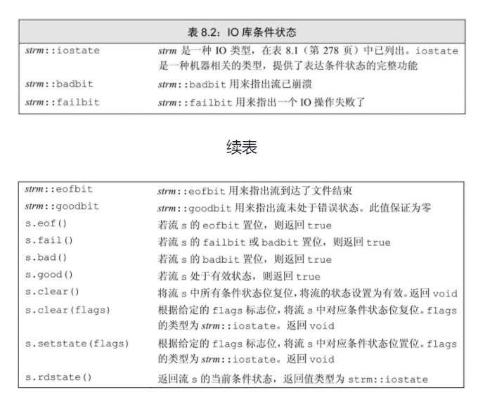

# IO 库

- stream（输入流）类型，提供输入操作。
- ostream（输出流）类型，提供输出操作。
- cin，一个 istream 对象，从标准输入读取数据
- cout，一个 ostream 对象，向标准输出写入数据
- cerr，一个 ostream 对象，通常用于输出程序错误消息，写入到标准错误。
- `>>`运算符，用来从一个 istream 对象读取输入数据。
- `<<`运算符，用来向一个 ostream 对象写入输出数据。
- getline 函数（参见 3.3.2 节，第 78 页），从一个给定的 istream 读取一行数据，存入一个给定的 string 对象中。

## IO 类

- iostream：iostream 定义了用于读写流的基本类型
- fstream：fstream 定义了读写命名文件的类型
- sstream：sstream 定义了读写内存 string 对象的类型

### IO 对象无拷贝或赋值

```c++
ofstream out1, out2;
out1 = out2; // 错误，不能对流对象赋值
ofstream print(ofstream); // 错误，不能初始化ofstream参数
out2 = print(out2); // 错误，不能拷贝流对象
```

### 条件状态



### 管理输出缓冲

导致缓冲刷新的原因：

- 程序正常结束，作为 main 函数的 return 操作的一部分，缓冲刷新被执行。
- 缓冲区满时，需要刷新缓冲，而后新的数据才能继续写入缓冲区。
- 我们可以使用操纵符如 endl 来显式刷新缓冲区。
- 在每个输出操作之后，我们可以用操纵符 unitbuf 设置流的内部状态，来清空缓冲区。默认情况下，对 cerr 是设置 unitbuf 的，因此写到 cerr 的内容都是立即刷新的。
- 一个输出流可能被关联到另一个流。在这种情况下，当读写被关联的流时，关联到的流的缓冲区会被刷新。例如，默认情况下，cin 和 cerr 都关联到 cout。因此，读 cin 或写 cerr 都会导致 cout 的缓冲区被刷新。

```c++
cout << "Hi" << endl; // 输出hi和换行，然后刷新缓冲区
cout << "hi" << flush; // 输出hi，然后刷新缓冲区
cout << "hi" << ends; // 输出hi和一个空字符串，然后刷新缓冲区

cout << unitbuf; //所有输出操作后都会立即刷新缓冲区
cout << nounitbuf; // 回到正常的缓冲方式
```

## 文件输入输出

头文件 fstream 定义了三个类型来支持文件 IO：ifstream 从一个给定文件读取数据，ofstream 向一个给定文件写入数据，以及 fstream 可以读写给定文件

### 使用文件流对象

```c++
ifstream input(argv[1]);
ofstream output(argv[2]);

Sales_data total;

if (read(input, total)) {
    Sales_data trans;
    while(read(input, trans)) {
        if (total.isbn() == trans.isbn()) {
            total.combine(trans);
        } else {
            print(output, total) << endl;
            total = trans;
        }
    }
    print(output, total) << endl;
} else {
    cerr << "no data" << endl;
}
```

### 文件模式

- in：只读
- out：只写
- app：append
- ate：打开文件后立即定位到文件末尾
- trunc：截断文件
- binary：以二进制方式进行 IO

## string 流

istringstream 从 string 读取数据，ostringstream 向 string 写入数据，而头文件 stringstream 既可从 string 读数据也可向 string 写数据。

### 使用 istringstream

```c++
struct PersonInfo{
    string name;
    vector<string> phones;
}

string line, word;
vector<PersonInfo> people;
while(getline(cin, line)) {
    PersonInfo pi;
    istringstream record(line);
    record >> info.name;
    while (record >> word) {
        info.phones.push_back(word);
    }
    people.push_back(info);
}
```

### 使用 ostringstream

```c++
for (const auto &entry : people) {
    ostringstream formatted, badNums;
    for (const auto &nums: entry.phones) {
        if (!valid(nums)) {
            badNums << "" << nums;
        } else {
            formatted << "" << format(nums);
        }
    }
    if (badNums.str().empty()) {
        os << entry.name << "" << formatted.str() << endl;
    } else {
        cerr << "input error: " << entry.name << badNums.str() << endl;
    }
}
```
