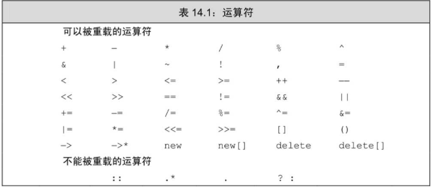

# 重载运算与类型转换

## 基本概念

重载的运算符是具有特殊名字的函数：它们的名字由关键字 operator 和其后要定义的运算符号共同组成。和其他函数一样，重载的运算符也包含返回类型、参数
列表以及函数体。



```c++
// non member operator function
data1 + data2;
operator+(data1, data2);

// member operator function
data1 += data2;
data1.operator+=(data2);
```

### 某些运算符不应该被重载

### 使用与内置类型一致的含义
